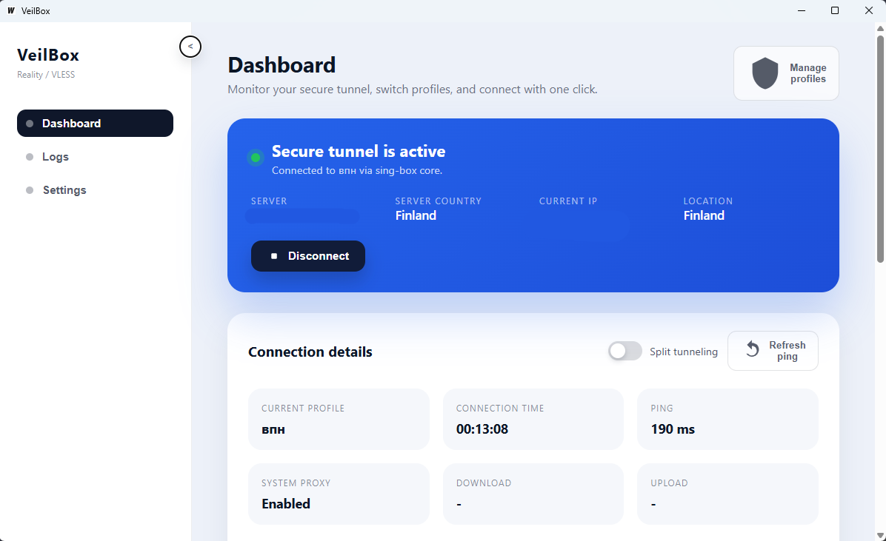

<p align="center">
  
</p>

<h1 align="center">VeilBox - Windows client for sing-box (Wails + React)</h1>

<p align="center">
  <a href="https://go.dev/"></a>
  <a href="https://wails.io/"></a>
  
  
</p>

> VeilBox is a Windows desktop client that wraps sing-box with a modern Wails (Go + React) UI. Runtime assets live in `%LOCALAPPDATA%\VeilBox`, the installer is produced with Inno Setup.

---

## Highlights

- Import VLESS Reality URIs manually with live preview and country detection.
- Subscribe to remote lists (`https://<host>/sub/...`) with automatic parsing, traffic usage display, and expiry tracking.
- Update subscriptions with a single click while keeping the currently selected node.
- Import configuration or subscription links directly from the clipboard.
- Automatically enable or disable the system proxy when connecting or disconnecting.
- Show live connection metrics: ping, session duration, public IP, and location.
- Manage split tunneling, DNS upstreams, and region routing rules from the UI.
- Tray integration for quick access while the app runs in the background.

---

## Screenshots

<p align="center">
  
</p>


---

## Repository layout

```
VeilBox/
|-- app.go                 # Wails entry point, subscription fetcher, system proxy control, logs
|-- runner.go              # sing-box launcher, config management in %LOCALAPPDATA%
|-- frontend/              # React application (TypeScript + Vite)
|   |-- src/App.tsx        # Main UI, profile and subscription flows
|   `-- wailsjs/           # Auto-generated bindings for Go <-> TS
|-- core/                  # sing-box.exe and native dependencies (wintun.dll, ...)
|-- build/                 # Windows resources and Inno Setup scripts
|   `-- installer/veilbox.iss
`-- docs/                  # Branding assets and screenshots
```

---

## Prerequisites

- Go 1.22+
- Node.js 18+
- Microsoft Build Tools (MSVC)
- WebView2 Runtime (downloaded automatically; override in `wails.json` if needed)
- Inno Setup (to build the installer)

Verify your environment:

```powershell
wails doctor
```

---

## Developer quick start

```powershell
# install frontend dependencies
cd frontend
npm install

# go back to the repo root and launch dev mode
cd ..
wails dev
```

The app opens inside WebView2; changes in `frontend/src` hot-reload automatically.

---

## Importing profiles and subscriptions

1. Click **Import config** (or **Import from clipboard** if you already copied a link).
2. Paste either a VLESS URI (`vless://...`) or a subscription URL (`https://<host>/sub/...`).
3. VLESS inputs show a preview; subscriptions create a grouped list of nodes.
4. After saving, the subscription card shows usage counters and last update time. Press **Refresh** to fetch the latest nodes.
5. Traffic limits come from the `subscription-userinfo` header when supplied by the provider.

---

## Building a release

```powershell
wails build -clean
```

- Output binary: `build/bin/VeilBox.exe` (rename `wailsapp.exe` if required).

Create the installer with Inno Setup:

1. Open `build/installer/veilbox.iss` in Inno Setup Compiler.
2. Hit **Compile** - the installer will appear under `build/dist/VeilBoxSetup.exe`.

---

## Useful commands

```powershell
# run the UI without packaging
wails dev

# rebuild the frontend bundle
npm --prefix frontend run build
```

---

## Troubleshooting

**`FATAL ... open cache.db: Access is denied`**  
Move the project to a user-writable folder (for example `C:\Users\your-name\VeilBox`) and make sure `%LOCALAPPDATA%\VeilBox` is accessible.

**sing-box console window pops up**  
Ensure `runner.go` launches the process with `HideWindow` and `CREATE_NO_WINDOW`.

**Subscription refresh fails**  
Check that the URL is reachable from Windows. VeilBox downloads subscriptions directly, so it needs working connectivity (or a preconfigured proxy) at refresh time.

---

## License

VeilBox is released under the [MIT](LICENSE) license.

---

## Credits

- [Wails](https://wails.io/) - cross-platform desktop framework for Go developers.
- [sing-box](https://sing-box.sagernet.org/) - VPN/proxy core that powers VeilBox.
