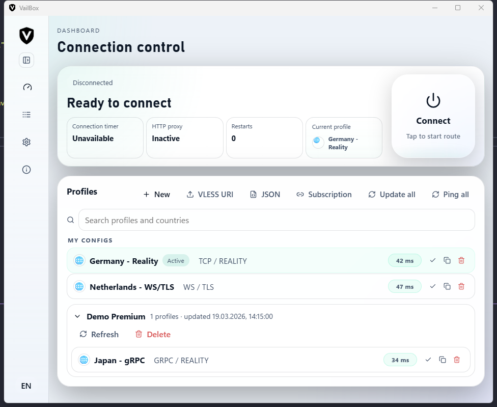
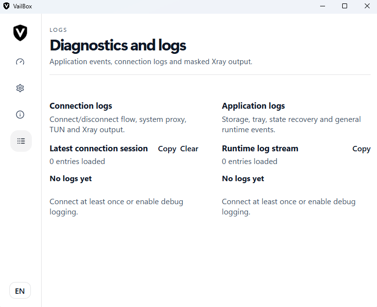
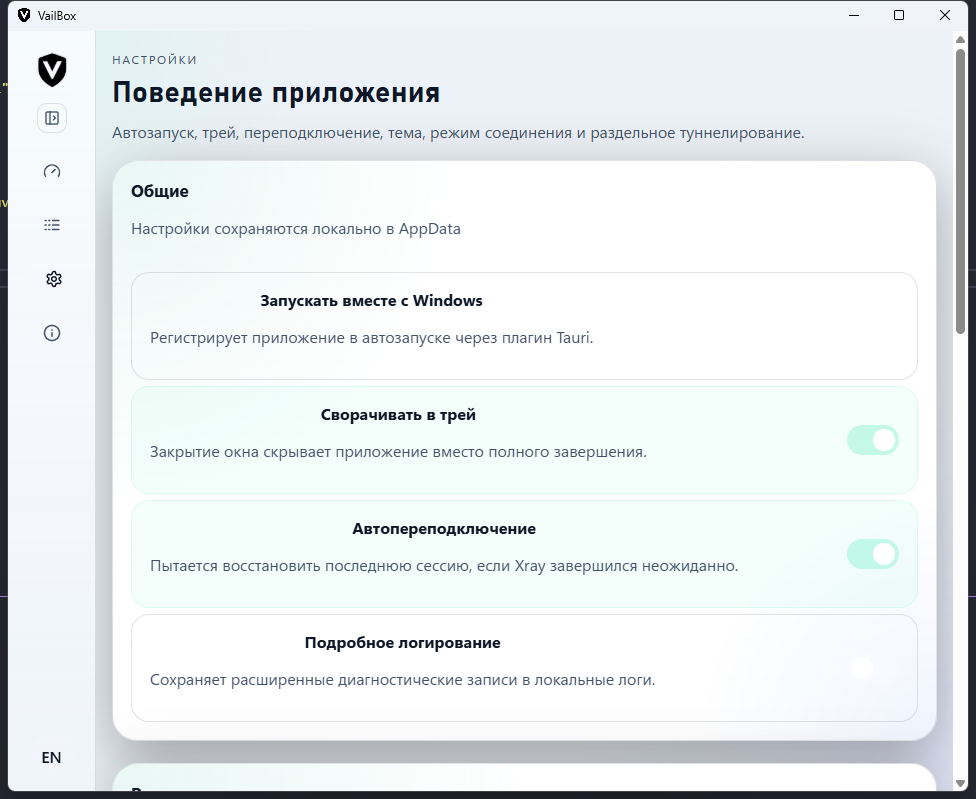

# VailBox

VailBox is a Windows desktop client built with Tauri and powered by Xray routing.  
It helps you quickly import VLESS profiles, choose the right route, and manage connections without an overloaded UI.



## Screenshots

| Logs | Settings |
| --- | --- |
|  |  |

## Advantages

- Clean interface: connection control, profiles, import, and route selection are all in one place.
- Fast setup: supports import via `VLESS URI`, `JSON`, subscriptions, and regular `Ctrl+V`.
- Flexible traffic handling: includes `System Proxy`, `TUN`, and split tunneling.
- Built for daily use: tray support, autostart, auto reconnect, themes, and language switching.
- Useful diagnostics: latency checks, profile testing, app logs, connection logs, and Xray output.

## Features

- Connection management through `Xray` with local profile storage.
- Manual profile creation, editing, duplication, and deletion.
- Subscription import and refresh with grouped profiles.
- Latency checks for quickly picking the best server.
- Support for `VLESS` profiles with `Reality`, `TLS`, `WS`, `gRPC`, `XHTTP`, `HTTPUpgrade`, and `mKCP`.
- Connection mode selection: `System Proxy` or `TUN`.
- Split tunneling by domains and IP/CIDR.
- Last selected profile persistence and session recovery.

## Quick Start

1. Place `xray.exe` into `src-tauri/bin/xray.exe`.
2. For `TUN` mode, place `wintun.dll` into `src-tauri/bin/wintun.dll`.
3. Install dependencies:

```powershell
npm install
```

4. Start the app:

```powershell
npm run tauri dev
```

5. Build a release:

```powershell
npm run tauri build
```

## Platform

- Windows 10/11
