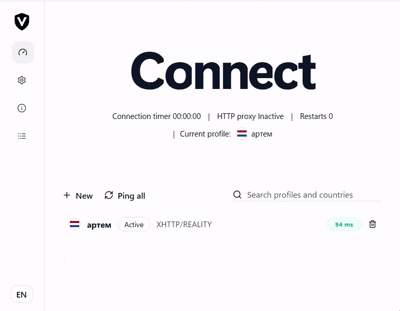

# VeilBox

VeilBox is a modern Windows VPN client built for fast profile import, clean routing control, and a simple daily workflow.

It supports `VLESS/Xray`, `System Proxy`, `TUN`, split tunneling, subscriptions, and `AmneziaWG` import in one desktop app.

Website: [https://veilbox.site/](https://veilbox.site/)



## Why VeilBox

- Clean desktop UI with no overloaded panels
- Fast import from `VLESS URI`, `JSON`, subscriptions, `Amnezia`, and `Ctrl+V`
- `System Proxy` and `TUN` modes in one app
- Split tunneling for real daily use
- Profile ping, connection test, grouped subscriptions, and logs
- Tray support, autostart, auto reconnect, light and dark themes

## What It Supports

- `VLESS`: `RAW / TCP / WS / gRPC / XHTTP / HTTPUpgrade / mKCP`
- Security: `None / TLS / Reality`
- Engines:
  - `Xray`
  - `AmneziaWG` import and runtime support
- Connection modes:
  - `System Proxy`
  - `TUN`

## Quick Start

1. Put `xray.exe` into:

```text
src-tauri/bin/xray.exe
```

2. For `TUN` mode, also put:

```text
src-tauri/bin/wintun.dll
```

3. For `AmneziaWG`, put:

```text
src-tauri/bin/amneziawg.exe
src-tauri/bin/awg.exe
```

4. Install dependencies:

```powershell
npm install
```

5. Run in development:

```powershell
npm run tauri dev
```

6. Build installer:

```powershell
npm run tauri build
```

The NSIS installer will be generated here:

```text
src-tauri/target/release/bundle/nsis/
```

## Platform

- Windows 10
- Windows 11

## Legal

- [Privacy Policy](./PRIVACY.md)
- [Terms of Use](./TERMS.md)
- [Third-Party Notices](./THIRD_PARTY_NOTICES.md)
- [Support](./SUPPORT.md)
